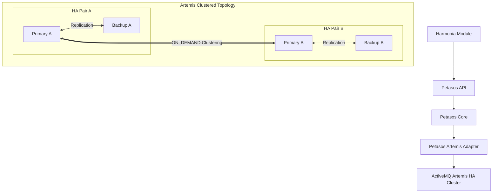

# Petasos Architecture

See the root documentation at [docs/architecture.md](../../docs/architecture.md) for the complete specification.

```mermaid
graph TD
    HM[Harmonia Module] --> PAPI[Petasos API]
    PAPI --> PCOR[Petasos Core]
    PCOR --> PART[Petasos Artemis Adapter]
    PART --> CLUS[ActiveMQ Artemis HA Cluster]

    subgraph "Artemis Clustered Topology"
        direction LR
        subgraph "HA Pair A"
            PA[Primary A] <-->|Replication| BA[Backup A]
        end

        subgraph "HA Pair B"
            PB[Primary B] <-->|Replication| BB[Backup B]
        end

        PA <=====>|ON_DEMAND Clustering| PB
    end
```
