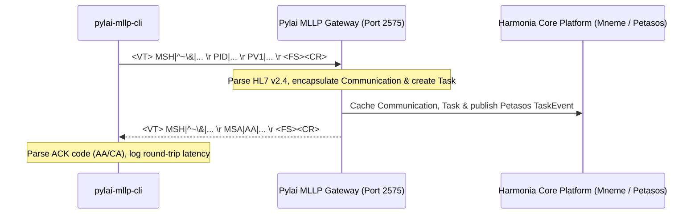

# Harmonia Pylai MLLP Gateway CLI

A high-performance command-line utility for generating, customizing, and transmitting HL7 v2.4 ADT (Admission, Discharge, Transfer) messages over Minimal Lower Layer Protocol (MLLP) to the Harmonia Pylai MLLP Gateway (`pylai-mllp-in`).

Built with Java 21 and [Picocli](https://picocli.info/), this tool provides pre-configured templates, dynamic parameter overrides, raw payload ingestion, dry-run inspection, and verbose network diagnostics.

---

## Table of Contents

- [Overview](#overview)
- [Architecture & MLLP Protocol](#architecture--mllp-protocol)
- [Prerequisites](#prerequisites)
- [Building & Packaging](#building--packaging)
- [Quick Start](#quick-start)
- [Command-Line Options](#command-line-options)
- [Supported ADT Message Templates](#supported-adt-message-templates)
- [Usage Examples & Recipes](#usage-examples--recipes)
  - [1. Listing Available Templates](#1-listing-available-templates)
  - [2. Dry-Run Message Inspection](#2-dry-run-message-inspection)
  - [3. Sending an Admission (ADT^A01)](#3-sending-an-admission-adta01)
  - [4. Sending a Patient Transfer (ADT^A02)](#4-sending-a-patient-transfer-adta02)
  - [5. Sending a Patient Discharge (ADT^A03)](#5-sending-a-patient-discharge-adta03)
  - [6. Updating Patient Demographics (ADT^A08)](#6-updating-patient-demographics-adta08)
  - [7. Patient Identifier Merge (ADT^A40)](#7-patient-identifier-merge-adta40)
  - [8. Sending a Raw HL7 Message File](#8-sending-a-raw-hl7-message-file)
  - [9. Sending an Inline Raw HL7 String](#9-sending-an-inline-raw-hl7-string)
  - [10. Targeting Remote Gateways & Custom Ports](#10-targeting-remote-gateways--custom-ports)
  - [11. Verbose Network & Framing Diagnostics](#11-verbose-network--framing-diagnostics)
- [Environment Variables](#environment-variables)
- [Exit Codes & CI/CD Automation](#exit-codes--cicd-automation)
- [Troubleshooting](#troubleshooting)
- [License](#license)

---

## Overview

The `pylai-mllp-cli` serves as the primary testing, verification, and synthetic data ingestion client for the Harmonia Pylai MLLP Gateway subsystem. It enables engineers and system integrators to:

- **Verify Integration**: Test end-to-end processing pipelines (Pylai MLLP Gateway -> Camel Routes -> Communication Resource -> Ergon Task -> Mneme Cache / Mnemosyne Store).
- **Simulate Clinical Events**: Generate realistic clinical trigger events (admit, transfer, discharge, registration, demographics updates, record merges) without requiring an external Electronic Health Record (EHR) system.
- **Inspect Payloads**: Validate HL7 v2.4 message framing, segment ordering, and delimiter structures before network transmission using dry-run mode.
- **Diagnose Network Issues**: Inspect socket-level communication and HL7 ACK/NACK responses directly from the terminal.

---

## Architecture & MLLP Protocol

The CLI communicates over standard TCP sockets using the **Minimal Lower Layer Protocol (MLLP)** framing standard:

```
[Start Block: 0x0B (<VT>)] + [HL7 Message Payload (\r delimited)] + [End Block: 0x1C (<FS>)] + [Carriage Return: 0x0D (<CR>)]
```



### Response Evaluation
- **Success (`AA` / `CA`)**: The gateway accepted and processed the message. Returns exit code `0`.
- **Error / Reject (`AE` / `AR` / `CE` / `CR`)**: The gateway rejected or encountered an error processing the message. Returns exit code `1`.
- **Timeout / Network Error**: Socket connection refused or timed out. Returns exit code `1`.

---

## Prerequisites

- **Java Development Kit (JDK)**: Version 21 or higher
- **Apache Maven**: Version 3.9+ (for building from source)
- **Running MLLP Gateway**: An active instance of `mllp-gateway` (default: `localhost:2575`) or the full platform via Docker Compose (`docker compose up -d`).

---

## Building & Packaging

Build the executable shaded JAR from the project root or the module directory:

```bash
# From project root:
mvn clean package -pl pylai/pylai-mllp-cli -DskipTests

# Or from inside pylai/pylai-mllp-cli:
cd pylai/pylai-mllp-cli
mvn clean package -DskipTests
```

The build produces a self-contained executable JAR located at:
```
pylai/pylai-mllp-cli/target/pylai-mllp-cli-1.0.0-SNAPSHOT.jar
```

### Creating a Shell Alias (Optional)
To run the CLI easily from any terminal:

```bash
alias mllp-cli="java -jar $(pwd)/pylai/pylai-mllp-cli/target/pylai-mllp-cli-1.0.0-SNAPSHOT.jar"
```

---

## Quick Start

Send a standard patient admission message (`ADT^A01`) to a local gateway running on default port `2575`:

```bash
java -jar pylai/pylai-mllp-cli/target/pylai-mllp-cli-1.0.0-SNAPSHOT.jar \
  -t A01 \
  -m PAT10001 \
  -f JANE \
  -l DOE \
  -g F \
  -d 1985-04-12
```

*Output:*
```text
Sending MLLP message to localhost:2575 (timeout: 5000ms)...
[SUCCESS] Received HL7 ACK (12 ms)
  ACK Code:           AA
  Message Control ID: MSG-CLI-1788754594368-5780
```

---

## Command-Line Options

| Option | Long Option / Alias | Env Variable | Default | Description |
| :--- | :--- | :--- | :--- | :--- |
| `-t` | `--template` | - | `A01` | Pre-defined ADT template code (`A01`, `A02`, `A03`, `A04`, `A05`, `A08`, `A11`, `A12`, `A13`, `A31`, `A40`) or full type (`ADT^A01`). |
| `-m` | `--mrn` | - | `PAT10001` | Patient Medical Record Number (PID-3). |
| `-f` | `--first-name`, `--firstName` | - | `JOHN` | Patient First / Given Name (PID-5.2). |
| `-l` | `--last-name`, `--lastName` | - | `DOE` | Patient Last / Family Name (PID-5.1). |
| `-d` | `--dob`, `--date-of-birth`, `--birthDate` | - | `19800101` | Patient Date of Birth (format: `YYYY-MM-DD` or `YYYYMMDD`) (PID-7). |
| `-g` | `--gender`, `--sex` | - | `M` | Administrative Gender (`M`, `F`, `O`, `U`) (PID-8). |
| `-H` | `--host` | `MLLP_HOST` | `localhost` | MLLP Gateway target hostname or IP address. |
| `-p` | `--port` | `MLLP_PORT` | `2575` | MLLP Gateway target TCP port. |
| | `--timeout` | - | `5000` | Socket connect and read timeout in milliseconds. |
| | `--message-id`, `--control-id` | - | *Auto-generated* | HL7 message control ID (MSH-10). |
| | `--visit-number`, `--encounter-id` | - | *Auto-generated* | Patient visit or encounter identifier (PV1-19). |
| | `--location` | - | `WARD1^RM01^BED1` | Assigned patient location (PV1-3). |
| | `--attending-doc` | - | `DOC01^SMITH^JOHN^^DR` | Attending physician identifier and name (PV1-7). |
| | `--sending-app` | - | `HIE_CLI` | Sending application namespace (MSH-3). |
| | `--sending-facility` | - | `FACILITY_CLI` | Sending facility namespace (MSH-4). |
| | `--receiving-app` | - | `HIE` | Receiving application namespace (MSH-5). |
| | `--receiving-facility` | - | `HIE_IM` | Receiving facility namespace (MSH-6). |
| | `--file` | - | - | Path to a raw HL7 message file to send. |
| | `--raw-message` | - | - | Raw HL7 message string to send directly. |
| `-n` | `--dry-run` | - | `false` | Generate and print the HL7 message to stdout without transmitting. |
| | `--list-templates` | - | `false` | Display all available ADT message templates and exit. |
| `-v` | `--verbose` | - | `false` | Print detailed message payload, socket lifecycle, and raw ACK frame. |
| `-h` | `--help` | - | - | Display help documentation and exit. |
| `-V` | `--version` | - | - | Print version information and exit. |

---

## Supported ADT Message Templates

The CLI contains 11 pre-configured HL7 v2.4 ADT trigger event templates:

| Code | Message Type | Description | Default Class | Core Segments |
| :--- | :--- | :--- | :---: | :--- |
| **`A01`** | `ADT^A01` | Admit / Visit Notification | Inpatient (`I`) | `MSH`, `EVN`, `PID`, `PV1` |
| **`A02`** | `ADT^A02` | Transfer a Patient | Inpatient (`I`) | `MSH`, `EVN`, `PID`, `PV1` |
| **`A03`** | `ADT^A03` | Discharge / End Visit | Inpatient (`I`) | `MSH`, `EVN`, `PID`, `PV1` |
| **`A04`** | `ADT^A04` | Register a Patient | Outpatient (`O`) | `MSH`, `EVN`, `PID`, `PV1` |
| **`A05`** | `ADT^A05` | Pre-Admit a Patient | Preadmit (`P`) | `MSH`, `EVN`, `PID`, `PV1` |
| **`A08`** | `ADT^A08` | Update Patient Information | Inpatient (`I`) | `MSH`, `EVN`, `PID`, `PV1` |
| **`A11`** | `ADT^A11` | Cancel Admit / Visit Notification | Inpatient (`I`) | `MSH`, `EVN`, `PID`, `PV1` |
| **`A12`** | `ADT^A12` | Cancel Transfer | Inpatient (`I`) | `MSH`, `EVN`, `PID`, `PV1` |
| **`A13`** | `ADT^A13` | Cancel Discharge / End Visit | Inpatient (`I`) | `MSH`, `EVN`, `PID`, `PV1` |
| **`A31`** | `ADT^A31` | Update Person Information | Outpatient (`O`) | `MSH`, `EVN`, `PID`, `PV1` |
| **`A40`** | `ADT^A40` | Merge Patient - Patient Identifier List | Inpatient (`I`) | `MSH`, `EVN`, `PID`, `MRG`, `PV1` |

---

## Usage Examples & Recipes

### 1. Listing Available Templates
Inspect all supported templates and default patient classes:

```bash
java -jar pylai/pylai-mllp-cli/target/pylai-mllp-cli-1.0.0-SNAPSHOT.jar --list-templates
```

---

### 2. Dry-Run Message Inspection
Preview the generated HL7 v2.4 message without opening a network connection using `-n` / `--dry-run`:

```bash
java -jar pylai/pylai-mllp-cli/target/pylai-mllp-cli-1.0.0-SNAPSHOT.jar \
  -t A01 \
  -m PAT98765 \
  -f ROBERT \
  -l ROBERTSON \
  -g M \
  -d 1974-11-23 \
  --location "ICU^RM04^BED2" \
  -n
```

*Output:*
```text
----------------------------------------
Generated HL7 Message Payload:
----------------------------------------
MSH|^~\&|HIE_CLI|FACILITY_CLI|HIE|HIE_IM|20260907142000||ADT^A01|MSG-CLI-1788754800000-1234|P|2.4
EVN|A01|20260907142000
PID|1||PAT98765^^^HOSPITAL^MR||ROBERTSON^ROBERT^^^^||19741123|M|||123 Main Street^^Metropolis^NY^10001^USA||555-0100|||||ACC-PAT98765
PV1|1|I|ICU^RM04^BED2||||DOC01^SMITH^JOHN^^DR|||||||||||VN123456|||||||||||||||||||||||||20260907142000
----------------------------------------
[Dry Run] Message generated successfully. Skipping transmission.
```

---

### 3. Sending an Admission (ADT^A01)
Admit a patient to the Emergency Ward with a designated attending physician:

```bash
java -jar pylai/pylai-mllp-cli/target/pylai-mllp-cli-1.0.0-SNAPSHOT.jar \
  -t A01 \
  -m PAT-EMERG-101 \
  -f EMILY \
  -l CHEN \
  -g F \
  -d 1992-08-30 \
  --location "EMERG^BAY03^BED1" \
  --attending-doc "DOC55^TAYLOR^SARAH^^MD" \
  --visit-number "VN-20260907-001"
```

---

### 4. Sending a Patient Transfer (ADT^A02)
Transfer a patient from an emergency bed to an inpatient surgical ward:

```bash
java -jar pylai/pylai-mllp-cli/target/pylai-mllp-cli-1.0.0-SNAPSHOT.jar \
  -t A02 \
  -m PAT-EMERG-101 \
  -f EMILY \
  -l CHEN \
  --location "SURG^RM12^BED1" \
  --visit-number "VN-20260907-001"
```

---

### 5. Sending a Patient Discharge (ADT^A03)
Record patient discharge and conclusion of the clinical encounter:

```bash
java -jar pylai/pylai-mllp-cli/target/pylai-mllp-cli-1.0.0-SNAPSHOT.jar \
  -t A03 \
  -m PAT-EMERG-101 \
  -f EMILY \
  -l CHEN \
  --visit-number "VN-20260907-001"
```

---

### 6. Updating Patient Demographics (ADT^A08)
Update patient demographic information without altering encounter status:

```bash
java -jar pylai/pylai-mllp-cli/target/pylai-mllp-cli-1.0.0-SNAPSHOT.jar \
  -t A08 \
  -m PAT-EMERG-101 \
  -f EMILY \
  -l CHEN-WILLIAMS \
  -g F \
  -d 1992-08-30
```

---

### 7. Patient Identifier Merge (ADT^A40)
Merge duplicate patient records using standard `MRG` segment linking:

```bash
java -jar pylai/pylai-mllp-cli/target/pylai-mllp-cli-1.0.0-SNAPSHOT.jar \
  -t A40 \
  -m PAT-PRIMARY-001 \
  -f JOHN \
  -l DOE
```

---

### 8. Sending a Raw HL7 Message File
Transmit an existing `.hl7` or `.txt` file containing custom HL7 segments:

```bash
java -jar pylai/pylai-mllp-cli/target/pylai-mllp-cli-1.0.0-SNAPSHOT.jar \
  --file /path/to/custom_message.hl7
```

*Note:* If parameter flags (e.g., `-m`, `-f`, `-l`, `--location`) are provided alongside `--file`, the CLI will override the matching fields within the file's `MSH`, `PID`, and `PV1` segments before sending.

---

### 9. Sending an Inline Raw HL7 String
Send a one-off HL7 message directly from a shell script:

```bash
java -jar pylai/pylai-mllp-cli/target/pylai-mllp-cli-1.0.0-SNAPSHOT.jar \
  --raw-message "MSH|^~\&|EXT_SYS|CLINIC|HIE|HIE_IM|20260907140000||ADT^A04|MSG9901|P|2.4
PID|1||MRN5555^^^HOSPITAL^MR||CLARK^DAVID^^^^||19680214|M
PV1|1|O|CLINIC^ROOM1"
```

---

### 10. Targeting Remote Gateways & Custom Ports
Point to an external or containerized gateway host on a non-standard port:

```bash
# Using CLI parameters:
java -jar pylai/pylai-mllp-cli/target/pylai-mllp-cli-1.0.0-SNAPSHOT.jar \
  -H 192.168.1.50 \
  -p 2576 \
  --timeout 10000 \
  -t A01

# Or via environment variables:
export MLLP_HOST="mllp-gateway.internal.net"
export MLLP_PORT="2575"

java -jar pylai/pylai-mllp-cli/target/pylai-mllp-cli-1.0.0-SNAPSHOT.jar -t A01
```

---

### 11. Verbose Network & Framing Diagnostics
Enable `-v` / `--verbose` to view the full generated HL7 message, socket operations, and the raw ACK frame:

```bash
java -jar pylai/pylai-mllp-cli/target/pylai-mllp-cli-1.0.0-SNAPSHOT.jar -t A01 -v
```

*Verbose Output Example:*
```text
----------------------------------------
Generated HL7 Message Payload:
----------------------------------------
MSH|^~\&|HIE_CLI|FACILITY_CLI|HIE|HIE_IM|20260907142510||ADT^A01|MSG-CLI-1788755110123-9876|P|2.4
EVN|A01|20260907142510
PID|1||PAT10001^^^HOSPITAL^MR||DOE^JOHN^^^^||19800101|M|||123 Main Street^^Metropolis^NY^10001^USA||555-0100|||||ACC-PAT10001
PV1|1|I|WARD1^RM01^BED1||||DOC01^SMITH^JOHN^^DR|||||||||||VN876543|||||||||||||||||||||||||20260907142510

----------------------------------------
Sending MLLP message to localhost:2575 (timeout: 5000ms)...
[SUCCESS] Received HL7 ACK (15 ms)
  ACK Code:           AA
  Message Control ID: MSG-CLI-1788755110123-9876

Raw ACK Message:
MSH|^~\&|HIE|HIE_IM|HIE_CLI|FACILITY_CLI|20260907142510||ACK^A01|ACK-9876|P|2.4
MSA|AA|MSG-CLI-1788755110123-9876|Message accepted
```

---

## Environment Variables

| Variable | Description | Equivalent Flag | Default |
| :--- | :--- | :--- | :--- |
| `MLLP_HOST` | Default MLLP Gateway target host | `-H`, `--host` | `localhost` |
| `MLLP_PORT` | Default MLLP Gateway target port | `-p`, `--port` | `2575` |

*Note:* CLI flags explicitly passed via command line take precedence over environment variables.

---

## Exit Codes & CI/CD Automation

The CLI returns standard Unix exit codes suitable for shell scripting and CI/CD pipelines:

| Exit Code | Meaning | Description |
| :---: | :--- | :--- |
| **`0`** | `SUCCESS` | Message sent and accepted with HL7 `AA` or `CA` ACK, or dry-run / help / template listing completed. |
| **`1`** | `FAILURE` | Socket connection error, timeout, non-readable input file, unknown template, or HL7 `AE`/`AR`/`CR`/`CE` NACK. |

### Automated Testing Script Example
```bash
#!/usr/bin/env bash
set -e

JAR="pylai/pylai-mllp-cli/target/pylai-mllp-cli-1.0.0-SNAPSHOT.jar"

echo "Running MLLP Ingestion Smoke Tests..."

# 1. Test Admission
java -jar "$JAR" -t A01 -m "TEST-PAT-01" -f "ALICE" -l "SMITH" -g "F" -d "1990-01-15"

# 2. Test Transfer
java -jar "$JAR" -t A02 -m "TEST-PAT-01" --location "ICU^BED1"

# 3. Test Discharge
java -jar "$JAR" -t A03 -m "TEST-PAT-01"

echo "All MLLP ingestion tests passed successfully!"
```

---

## Troubleshooting

### Connection Refused (`Connection failed to localhost:2575`)
- Ensure the MLLP Gateway service is active (`docker compose ps mllp-gateway` or check server logs).
- Verify the port mapping is exposed (`2575:2575` in `docker-compose.yml`).

### Socket Timeout (`Socket timeout after 5000 ms`)
- Increase socket timeout using `--timeout <milliseconds>` (e.g., `--timeout 15000`).
- Ensure the gateway is not blocked by downstream storage contention (e.g., Infinispan cluster rebalancing).

### Unknown Template Error
- Run `--list-templates` to check valid template identifiers. Template codes are case-insensitive and support prefixes (e.g., `A01`, `a01`, `ADT^A01`, `ADT_A01`).

---

## License

Copyright (C) 2026 Mark Hunter.

This program is free software: you can redistribute it and/or modify it under the terms of the GNU General Public License as published by the Free Software Foundation, either version 3 of the License, or (at your option) any later version. See the [LICENSE](../../LICENSE) file for details.
